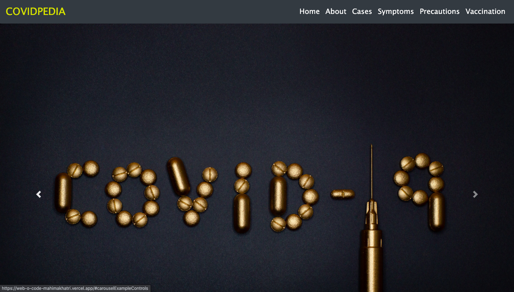
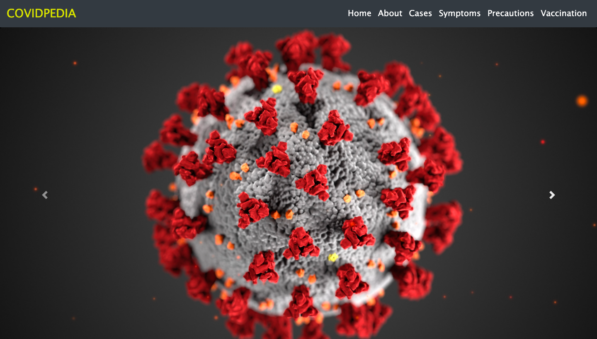
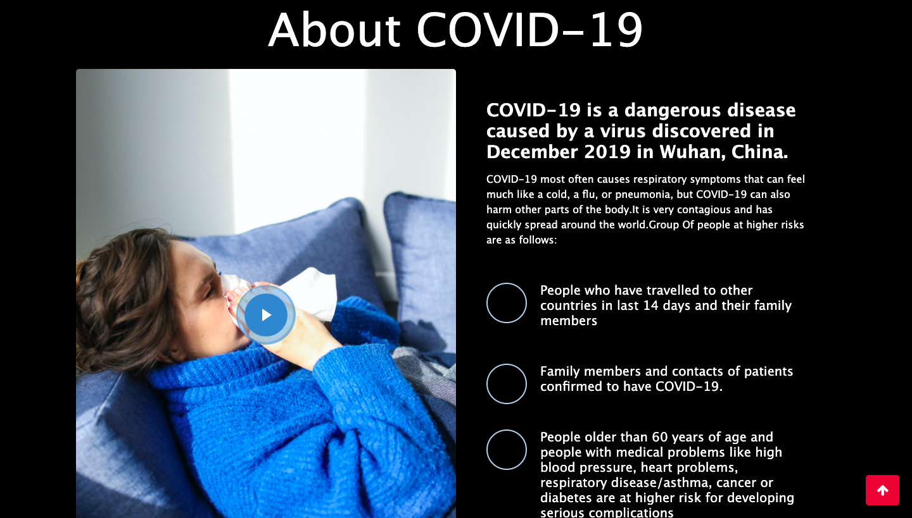
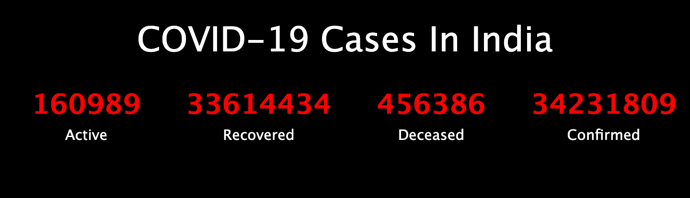
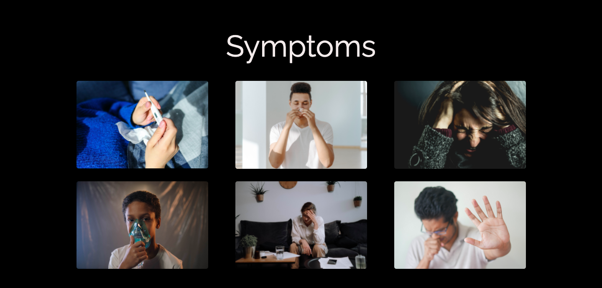
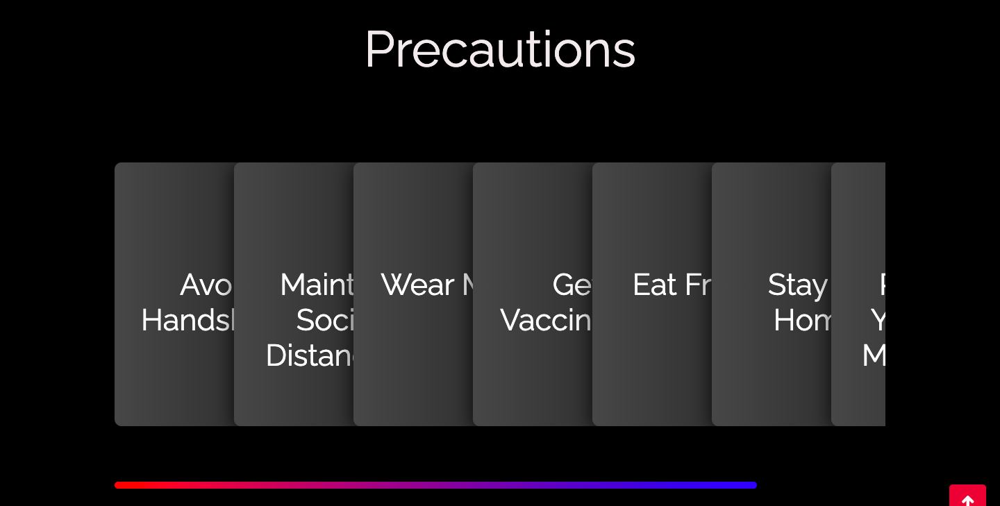
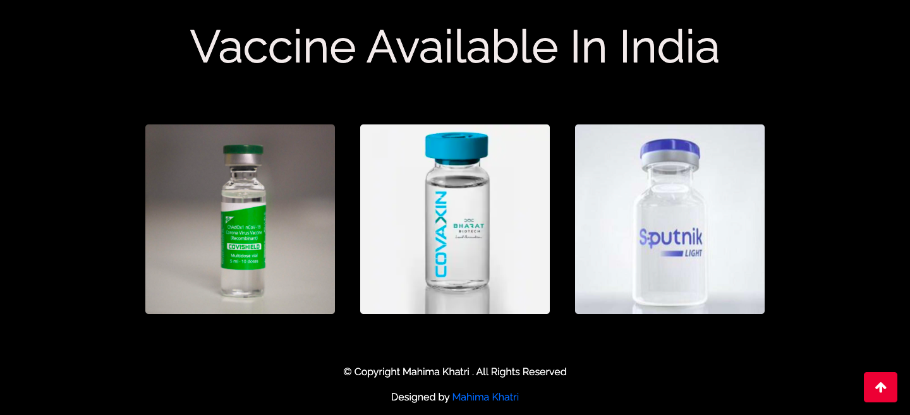

  
# COVIDPEDIA :closed_book:
 

## Introduction :shamrock:

In this project , a responsive website named as COVIDPEDIA is made using HTML ,CSS and Javascript .This website works as an awareness website which focuses on the disease CORONAVIRUS ,walking through its details , symptoms ,active cases , precautions that can be taken and vaccination available in India along with efficacy percentage.

The theme chosen for the project is Healthcare.

## Features :eyes:

### Home Page

### About Page

### COVID Cases Page

### Symptom Page

### Precaution Page

### Vaccination Page

## Demo

## Tech Stack

+ Html
+ CSS
+ JavaScript
+ BootStrap

## Developer :woman_technologist:
<table>
<td>

Mahima Khatri

</td>
</tr>
</table>
